[](https://img.shields.io/badge/license-UPL-green) [](https://sonarcloud.io/dashboard?id=oracle-devrel_tech-content-heatwave)

# Deploy AskME resources with terraform

This section explains how to deploy AskME in your tenancy, using the OCI Cloud Shell and terraform. The following resources are automatically created during the process:
-	A dynamic group and a policy in the root compartment
-	A Compartment for the AskME resources in the root compartment
-	An Object Storage bucket containing two documents
-	A Compute Instance to run the AskME app
-	A MySQL DBSystem with a HeatWave cluster
-	A Vault, a Vault key and three Vault secrets
-	A VCN with an Internet Gateway, two Security Lists and two Subnets

The application can then be accessed from your local machine, using local port forwarding, as detailed in [step 8](#step-8-use-askme).

## Step 1: Open OCI Cloud Shell
Sign In to [your OCI tenancy](http://cloud.oracle.com/), then [if possible](#oci-genai-models-not-available-in-askme) switch to a [region supporting OCI Generative AI](https://docs.oracle.com/en-us/iaas/Content/generative-ai/overview.htm#regions) (e.g: US Midwest), and open the Cloud Shell. <br />
You need to have the [Administrator role](https://docs.oracle.com/en-us/iaas/Content/Identity/roles/understand-administrator-roles.htm) to automatically deploy all AskME resources in your tenancy. Otherwise, some resources will need to be deployed manually, please check the section [Manual resource creation](#manual-resource-creation) for more information.

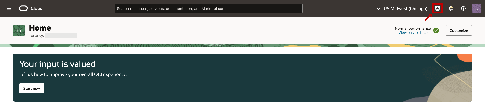

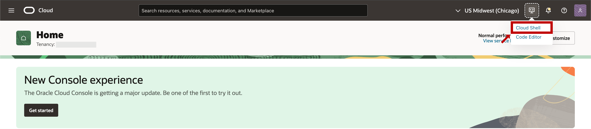

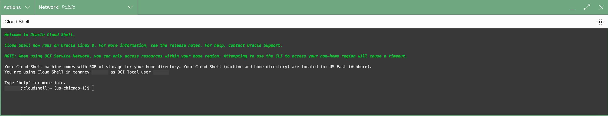

## Step 2: Get the repository archive
In the Cloud Shell interface, fetch the tech-content-heatwave repository archive.

Command:
```
wget -O tech-content-heatwave.zip -nv https://github.com/oracle-devrel/tech-content-heatwave/archive/refs/heads/tech-content-heatwave_askme.zip
```

## Step 3: Unzip the archive
Command:
```
unzip tech-content-heatwave.zip '*/askme/*' -d tech-content-heatwave
```

## Step 4: Change directory to the terraform folder
Command:
```
cd tech-content-heatwave/*/askme/terraform
```

## Step 5 (optional): Customize the setup
In the file `terraform.tfvars`, you can find three customization section:
- Parent compartment: you can provide the OCID of a parent compartment if you don't want to deploy the new AskME compartment and resources in the root compartment.
- Flexible resources: you can provide the OCID of resources that were already created by an administrator. It is especially important if you don't have Administrator privileges in the tenancy.<br /> You can modify any `null` value by the corresponding resource OCID.
- Compute and DBSystem parameters: you can choose the shape, version, ... of the compute instance and DBSystem. Don't modify these parameters if you are not sure what you are doing, as it may later negatively impact the performance or functionality of the application.

Please keep in mind that you don't need to change this file if you have Administrator permissions in the tenancy and if you are fine with the [deployment plan](#deploy-askme-resources-with-terraform).
Please check the section [Manual resource creation](#manual-resource-creation) for more information.

## Optional: Create a tmux session to run terraform
Command:
```
tmux new-session -A -s askme_session
```

## Step 6: Run the setup script
Run the script `askme_setup.sh`, and follow the instructions. Additional information will be asked by the script to setup the DBSystem and the compute instance.

Command:
```
sh askme_setup.sh
```

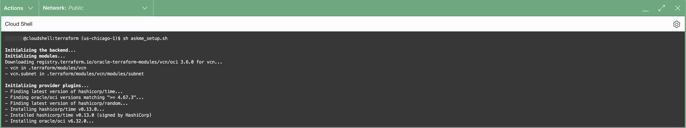

### Step 6.a: Common identifier

Prefix of the new resources to create to setup AskME (default: `heatwave-genai-askme`).

Any new compartment and resources will use this in their resource name. If your tenancy already contains a compartment with the default name `heatwave-genai-askme`, please provide another identifier and press Enter. Otherwise, no need to provide a value, press Enter and the default value will be used.

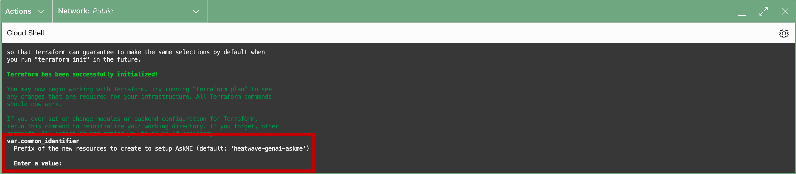


### Step 6.b: Allowed IPv4 CIDR block

Set of IPv4 addresses (CIDR notation) allowed to connect to the compute instance (default: `0.0.0.0/0`).

Any new VCN/public subnet will use this in their security list.<br />If OCID values have been provided for the public and private subnets in [step 5](#step-5-optional-customize-the-setup) ([VCN](#vcn)), this parameter will be skipped.

The CIDR notation follows the format: `a.b.c.d/e` where `a`, `b`, `c` and `d` are numbers between 0 and 255, and `e` is a number between 0 and 32. More information about the CIDR block notation in the [Network Overview](https://docs.oracle.com/en-us/iaas/Content/Network/Concepts/overview.htm#:~:text=CIDR%20NOTATION) page.

Use `0.0.0.0/0` to indicate all IP addresses. The prefix is required (for example, include the /32 if specifying an individual IP address). For more information, check the [Security Rules](https://docs.oracle.com/en-us/iaas/Content/Network/Concepts/securityrules.htm) page.

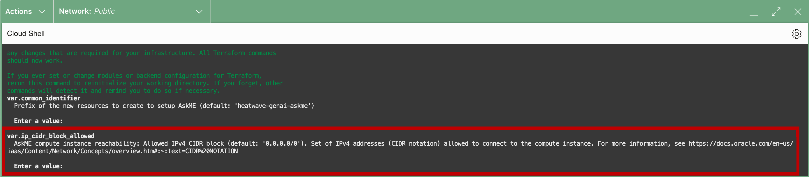

### Step 6.c: SSH authorized key

Content of the SSH public key file (OpenSSH format). The SSH key pair needs to be located in your local computer, as the SSH connection will be between your local computer and the AskME compute instance ([Step 8](#step-8-use-askme)).<br />
More information about SSH key pairs in the [Key Pair management and generation](https://docs.oracle.com/en-us/iaas/Content/Compute/Tasks/managingkeypairs.htm) page.

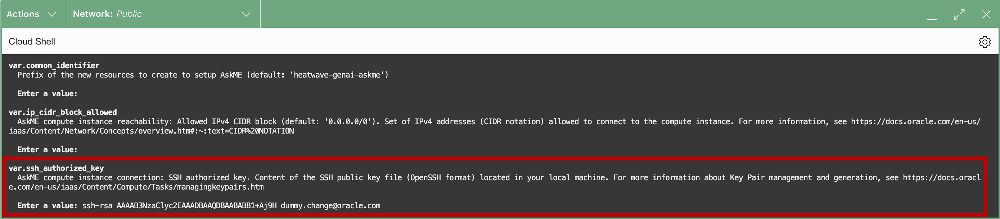

## Step 7: Resource deployment
Wait until the terraform deployment finishes. Expected deployment time: 30-40 minutes.

## Step 8: Use AskME
Connect to the AskME compute instance and access the streamlit page.
Follow the instructions provided in the Cloud Shell output. The instructions should look similar to this:
```
================================================
Open a terminal in your local computer.
Follow the instructions to add your SSH key to the SSH agent:
  https://docs.oracle.com/en/operating-systems/oracle-linux/openssh/openssh-UsingOpenSSHClientUtilities.html#ssh-key-agent-to-remember-passphrases
And run:
  ssh -L 8501:localhost:8501 opc@x.x.x.x
Then in your web browser, open the URL:
  127.0.0.1:8501
================================================
```

This information can be displayed again with the command `sh askme_output.sh` from the location described in [step 4](#step-4-change-directory-to-the-terraform-folder).

Note: if you don't want to add your SSH key to the SSH agent, you can specify the path to the private key in the SSH command instead:
```
ssh -i /path/to/ssh/private/key/file -L 8501:localhost:8501 opc@x.x.x.x
```

# Manual resource creation

Some users may not have the permission to create their own compartment, dynamic-group, policy, ... <br />
Another user with administrator privileges can follow these console instructions to create such resources manually. They can then provide you with the relevant resource OCIDs to use in [step 5](#step-5-optional-customize-the-setup).<br />
These manually created resources need to be located in the right region, i.e: the one in which the terraform script is being executed. Please check [here](#no-definition-found) for more information.

Please keep in mind that these steps are automatically covered by the terraform scripts; these steps are especially important for users who don't have Administrator permissions in the tenancy and who need to delegate the creation of some resources to an administrator.

## Compartment

Here are the instructions to create a compartment: [To create a compartment](https://docs.oracle.com/en-us/iaas/Content/Identity/Tasks/managingcompartments.htm#uscons)

For the name, you can use `heatwave-genai-askme`
You can create it in the tenancy (root compartment) or in another compartment, as you prefer.

Once created, you can `Show` and `Copy` its OCID.
You can use this OCID in the file mentioned in [step 5](#step-5-optional-customize-the-setup), by assigning its value to the key `compartment_ocid`.

Example:
```
compartment_ocid = "ocid1.compartment.oc1..aaaaaaaaaaaaaaaaaaaaaaaaaaaaaaaaaaaaaaaaaaaaaaaaaaaaaaaaaaaa"
```

This OCID will be useful if you need to manually create a dynamic-group/policy for your setup, as explained [below](#dynamic-group-and-policy).

## VCN

Here are the instructions to create a VCN with Internet Connectivity: [Create a VCN with Internet Connectivity](https://docs.oracle.com/en-us/iaas/Content/Network/Tasks/quickstartnetworking.htm#VCN_with_Internet_Connectivity)

Please make sure to review the security list entries of its public subnet and private subnet: [Getting Details for a Security List](https://docs.oracle.com/en-us/iaas/Content/Network/Concepts/getting_details-securitylist.htm):
- The public security list/subnet needs to accept TCP ingress traffic on port 22 and ICMP ingress traffic for Type 3, both on a permissive-enough Source CIDR (e.g: 0.0.0.0/0) such that you can connect to the compute instance from your computer via SSH.
- The private security list/subnet needs to accept TCP ingress traffic on ports 22, 3306, 33060 and ICMP ingress traffic for Type 3, both on a Source CIDR accepting all local machines (e.g: 10.0.0.0/16) such that the AskME compute instance can communicate with the DBSystem.

Once created and verified, you can click on its public and private subnets, and each time `Copy` their OCID value.
You can use these OCIDs in the file mentioned in [step 5](#step-5-optional-customize-the-setup), by assigning these values to the keys `public_vcn_subnet_ocid` and `private_vcn_subnet_ocid`.

Example:
```
public_vcn_subnet_ocid = "ocid1.subnet.oc1.us-chicago-1.aaaaaaaaaaaaaaaaaaaaaaaaaaaaaaaaaaaaaaaaaaaaaaaaaaaaaaaaaaaaaaaaaaaaaa"
private_vcn_subnet_ocid = "ocid1.subnet.oc1.us-chicago-1.aaaaaaaaaaaaaaaaaaaaaaaaaaaaaaaaaaaaaaaaaaaaaaaaaaaaaaaaaaaaaaaaaaaaab"
```

## Vault

Here are the instructions to create a Vault: [Creating a Vault] (https://docs.oracle.com/en-us/iaas/Content/KeyManagement/Tasks/managingvaults_topic-To_create_a_new_vault.htm#createnewvault) and [Creating a Master Encryption Key](https://docs.oracle.com/en-us/iaas/Content/KeyManagement/Tasks/managingkeys_topic-To_create_a_new_key.htm)

Once created, you can copy the Vault OCID and the Master Encryption Key OCID.
You can use these OCIDs in the file mentioned in [step 5](#step-5-optional-customize-the-setup), by assigning these values to the keys `vault_ocid` and `vault_key_ocid`.

Example:
```
vault_ocid = "ocid1.vault.oc1.us-chicago-1.aaaaaaaaaaaaaaaaaaaaaaaaaaaaaaaaaaaaaaaaaaaaaaaaaaaaaaaaaaaaaaaaaaaaaaaaaa"
```
```
vault_key_ocid = "ocid1.key.oc1.us-chicago-1.aaaaaaaaaaaaaaaaaaaaaaaaaaaaaaaaaaaaaaaaaaaaaaaaaaaaaaaaaaaaaaaaaaaaaaaaaa"
```

## Dynamic-group and policy

#### Create the dynamic-group

Here are the instructions to create the dynamic-group (by default: root compartment, default identity domain): [To create a dynamic group](https://docs.oracle.com/en-us/iaas/Content/Identity/Tasks/managingdynamicgroups.htm#three)

For the name, you can use `heatwave-genai-askme-dynamic-group`.

For the matching rules, you can select `Match any rules defined below` and create the following two rules:
```
instance.compartment.id = '${compartment_id}'
```
```
resource.compartment.id = '${compartment_id}'
```
Where you need to replace `${compartment_id}` in both rules by the ocid of the compartment [created above](#compartment).

#### Create the policy

Here are the instructions to create the policy (by default: root compartment): [To create a policy](https://docs.oracle.com/en-us/iaas/Content/Identity/Tasks/managingpolicies.htm#three)

For the name, you can use `heatwave-genai-askme-policy.pl`

For the policy builder, you can enter the following rules in the `manual editor`:
```
allow dynamic-group ${dynamic_group_name} to read volume-family in compartment id ${compartment_id}
allow dynamic-group ${dynamic_group_name} to read instance-family in compartment id ${compartment_id}
allow dynamic-group ${dynamic_group_name} to read objectstorage-namespaces in compartment id ${compartment_id}
allow dynamic-group ${dynamic_group_name} to read buckets in compartment id ${compartment_id}
allow dynamic-group ${dynamic_group_name} to manage objects in compartment id ${compartment_id}
allow dynamic-group ${dynamic_group_name} to read vaults in compartment id ${vault_compartment_id}
allow dynamic-group ${dynamic_group_name} to read secret-bundles in compartment id ${vault_compartment_id}
allow dynamic-group ${dynamic_group_name} to use generative-ai-chat in compartment id ${compartment_id}
allow dynamic-group ${dynamic_group_name} to use generative-ai-text-generation in compartment id ${compartment_id}
allow dynamic-group ${dynamic_group_name} to use generative-ai-text-summarization in compartment id ${compartment_id}
allow dynamic-group ${dynamic_group_name} to use generative-ai-text-embedding in compartment id ${compartment_id}
allow dynamic-group ${dynamic_group_name} to use generative-ai-model in compartment id ${compartment_id}
```
Where:
- You need to replace `${dynamic_group_name}` in all rules by the name of the dynamic group [created above](#create-the-dynamic-group) (e.g: `heatwave-genai-askme-dynamic-group`)
- You need to replace `${compartment_id}` in all rules by the ocid of the compartment [created above](#compartment).
- You need to replace `${vault_compartment_id}` in all rules by:
  - the ocid of the compartment containing the OCI Vault if [created manually](#vault)
  - OR the ocid of the compartment [created above](#compartment) otherwise

#### When the dynamic-group and the policy have been created

When the dynamic-group and the policy have been created, you can signal it in the file mentioned in [step 5](#step-5-optional-customize-the-setup), by setting the value of the key `dynamic_group_and_policy_created` to true:
```
dynamic_group_and_policy_created = true
```


# Cleanup AskME resources with terraform

This section explains how to remove AskME resources from your tenancy, using the OCI Cloud Shell and terraform.

#### Warning: Cleanup setup requirement
Please make sure that the AskME resources have been created following the [deployment instructions](#deploy-askme-resources-with-terraform), and that the setup folders/files located in [deployment step 4](#step-4-change-directory-to-the-terraform-folder) have not been modified or removed since the last deployment.

More specifically, please make sure that the file `terraform.tfstate` still exists there. If not, all resources described in the [deployment instructions](#deploy-askme-resources-with-terraform) need to be removed manually.

Resources that have not been deployed in [step 6](#step-6-run-the-setup-script) will not be removed. For example, resources whose OCIDs were provided for the deployment in [step 5](#step-5-optional-customize-the-setup) won't be removed.

#### Warning: Cleanup retention period
There is a retention period of 30 days before the OCI Vault can be removed, blocking the compartment deletion. If [step 6](#step-6-run-the-setup-script) created an OCI Vault, please rerun the [cleanup step 2](#step-2-run-the-cleanup-script) again after 30 days to complete the cleanup process.

## Step 1: Remove Vector Tables in the AskME app (if any)
Follow the instructions in [step 8](#step-8-use-askme) to access the streamlit page.
In the `Knowledge Base Management` tab, go to the section `Reset Knowledge Base` and follow the page instructions to remove all vector store tables.

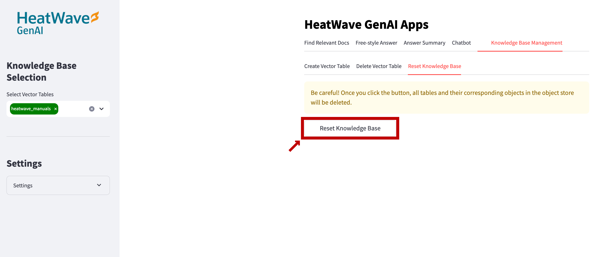

## Step 2: Run the cleanup script
Follow the instructions in [deployment step 1](#step-1-open-oci-cloud-shell) and [deployment step 4](#step-4-change-directory-to-the-terraform-folder) to use the Cloud Shell from the right location.

Run the script `sh askme_cleanup.sh`.

Command:
```
sh askme_cleanup.sh
```

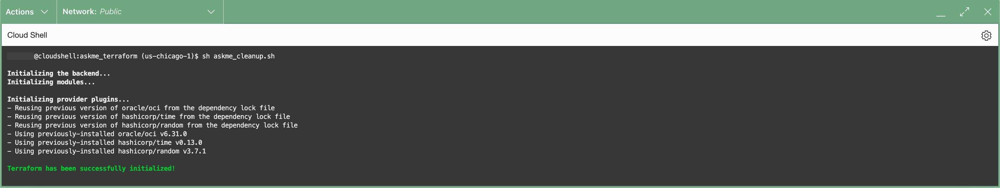


# Troubleshooting

## OCI GenAI models not available in AskME

Even though it is possible to deploy AskME in any region supporting the [deployment plan](#deploy-askme-resources-with-terraform), some LLMs are available only in the [regions supported by the OCI Generative AI service](https://docs.oracle.com/en-us/iaas/Content/generative-ai/overview.htm#regions).

This means that only a subset of the HeatWave GenAI models will work outside of these regions.
For more information, please check the [OCI Generative AI Service LLMs](https://dev.mysql.com/doc/heatwave/en/mys-hw-genai-supported-models.html#mys-hw-genai-oci-llms).

If you want to deploy AskME resources in a region supported by the OCI Generative AI service, please close the current Cloud Shell session (if any):

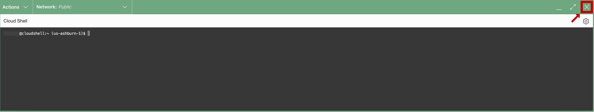

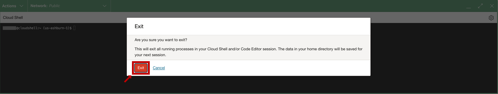

Then change the OCI Console region to a [region supporting OCI Generative AI](https://docs.oracle.com/en-us/iaas/Content/generative-ai/overview.htm#regions) (e.g: US Midwest):

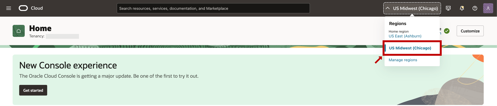

Then reopen the Cloud Shell ([step 1](#step-1-open-oci-cloud-shell)) and in the same folder as in [step 4](#step-4-change-directory-to-the-terraform-folder), please rerun [step 6](#step-6-run-the-setup-script).

## Iteration over null value

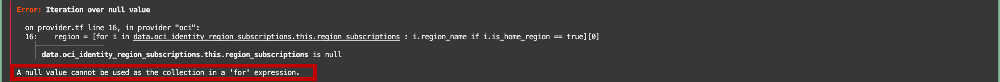

If you get the error "A null value cannot be used as the connection in a 'for' expression", please make sure that your OCI user has the permission `{TENANCY_INSPECT}` in the tenancy.

Without that permission, the OCI user is not allowed to list the tenancy regions, which is required to deploy AskME resources.

## Compartment already exists

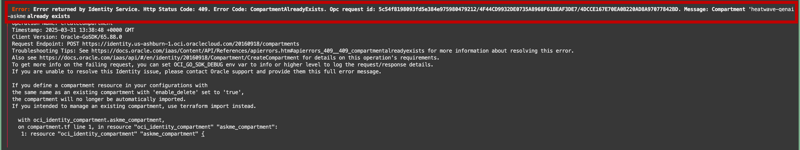

If the compartment already exists in your tenancy, please rerun the [step 6](#step-6-run-the-setup-script) and specify another common identifier in [step 6.a](#step-6a-common-identifier).

## Common identifier length must be between 4 and 20

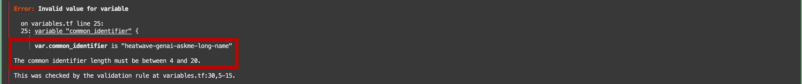

Please rerun [step 6](#step-6-run-the-setup-script) and use a smaller/longer common identifier in [step 6.a](#step-6a-common-identifier).

## Invalid IPv4 CIDR block notation

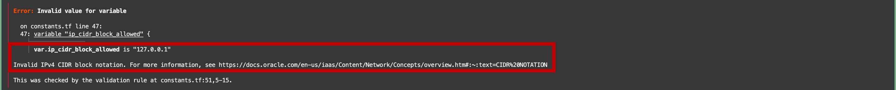

Please rerun [step 6](#step-6-run-the-setup-script) and provide a valid IPv4 block range in [step 6.b](#step-6b-allowed-ipv4-cidr-block), following the CIDR block notation.

More information about the CIDR block notation in the [Network Overview](https://docs.oracle.com/en-us/iaas/Content/Network/Concepts/overview.htm#:~:text=CIDR%20NOTATION) page.

## The SSH public key value must follow the OpenSSH format

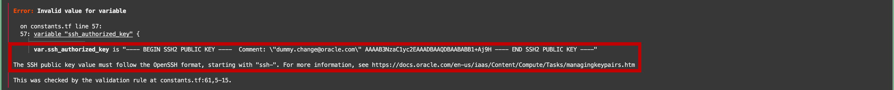

Please rerun [step 6](#step-6-run-the-setup-script) and provide a valid SSH public key in [step 6.c](#step-6c-ssh-authorized-key), following the OpenSSH format.

More information about SSH keys in the [Key Pair management and generation](https://docs.oracle.com/en-us/iaas/Content/Compute/Tasks/managingkeypairs.htm) page.

## Invalid function argument

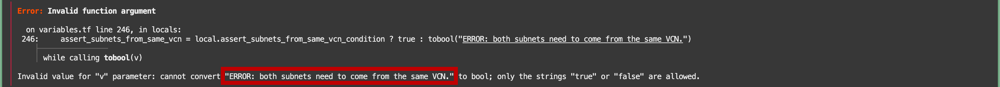

A precondition failed from the values provided in the file mentioned in [step 5](#step-5-optional-customize-the-setup).
The error message can be found in the last line between `cannot convert` and `to bool;`.

For example, the error highlighted here is about the subnets not being located in the same VCN. If you provide values for `public_vcn_subnet_ocid` and `private_vcn_subnet_ocid` in the file mentioned in [step 5](#step-5-optional-customize-the-setup), please make sure that those resources come from the same VCN, or replace the values for both `public_vcn_subnet_ocid` and `private_vcn_subnet_ocid` by `null` such that a new VCN with a private and a public subnet can be deployed by terraform.

Please fix the corresponding error in the file mentioned in [step 5](#step-5-optional-customize-the-setup) and rerun [step 6](#step-6-run-the-setup-script).

## No definition found

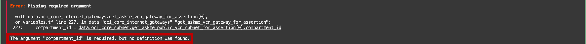

A precondition failed from the values provided in the file mentioned in [step 5](#step-5-optional-customize-the-setup).
Some resource OCID defined there can't be found because that resource does not exist in the current region, i.e: the one in which the terraform script is being executed, see [here](#step-1-open-oci-cloud-shell) and [here](#oci-genai-models-not-available-in-askme) for more information.

For example, the error highlighted here is about the `compartment_id` parameter of the public subnet. This means that the OCID value provided for `public_vcn_subnet_ocid` in the file mentioned in [step 5](#step-5-optional-customize-the-setup) does not exist in the current region.<br />
To solve this, you either need to use another region for the terraform deployment (see [here](#oci-genai-models-not-available-in-askme)), or you can use other VCN subnets from the right region, or you may need to move the existing VCN subnets to the right region.

Once the resource issue has been fixed, please rerun [step 6](#step-6-run-the-setup-script).

## Address already in use

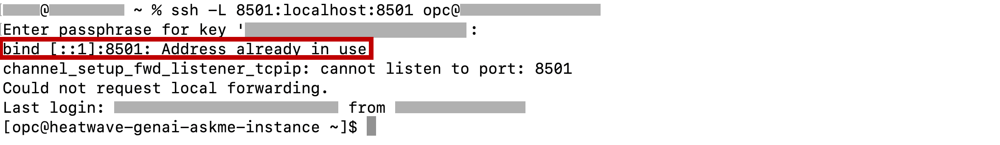

The connection to the AskME compute instance ([Step 8](#step-8-use-askme)) works, but it is not possible to connect to the address `127.0.0.1:8501`.

Please check the terminal messages after the SSH connection messages. If the message "Address already in use" appears, this means that another process is using the port 8501.

Please stop the SSH connection with the command `exit`, run the command:
 ```
ps -p $(sudo lsof -t -P -sTCP:LISTEN -i:8501) 2>/dev/null
```
in your local computer to understand which process(es) are using the port 8501.

If the process(es) should not be killed, you can change the part `-L 8501:localhost:8501` in the SSH command from [Step 8](#step-8-use-askme) to `-L 8502:localhost:8501` for example. This means that the address `127.0.0.1:8501` needs to change too, to `127.0.0.1:8502` in this example.
