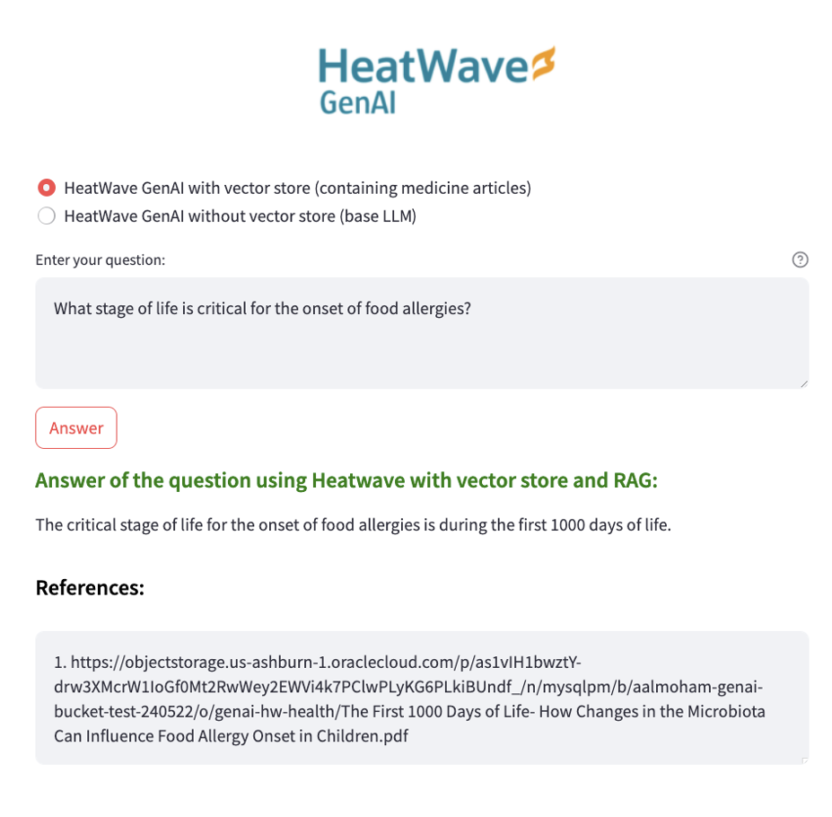

# Answering Health-Related Questions Using HeatWave with Vector Store

[](https://img.shields.io/badge/license-UPL-green) [](https://sonarcloud.io/dashboard?id=oracle-devrel_tech-content-heatwave)

## This repository demonstrates how to use HeatWave GenAI to build a Healthcare question-and-answer tool quickly and efficiently. With just a few steps, you can leverage HeatWave GenAI to create a tool for answering health-related questions based on custom documents.

## Introduction
HeatWave GenAI allows you to perform natural language queries on unstructured data using a familiar SQL interface. This capability streamlines tasks such as content generation, summarization, and retrieval-augmented generation (RAG). It supports seamless one-step searches using in-database or external LLMs, with all components optimized for integration with proprietary data.
In this repository, we focus on using HeatWave GenAI to create a healthcare tool that answers questions based on documents ingested into the HeatWave vector store. For more information about HeatWave GenAI, visit the [official documentation](https://dev.mysql.com/doc/heatwave/en/mys-hw-genai-overview.html).

## Getting Started

### Prerequisites

**HeatWave-Enabled Database System**: Ensure you have a database system with HeatWave enabled. Refer to the [Getting Started with MySQL HeatWave on OCI]( https://www.oracle.com/developer/getting-started-with-mysql-heatwave-on-oci/) guide for setup instructions.

### Steps
1. **Clone the Repository**:
   ```bash
   git clone https://github.com/oracle-devrel/tech-content-heatwave.git
   cd tech-content-heatwave/healthcare
    ```
2. **Install Dependencies**:
   - Create and activate a virtual environment:
     ```bash
     python -m venv venv
     source venv/bin/activate
     ```
   - Install the required packages:
     ```bash
     pip install -r requirements.txt
     ```

3. **Upload Healthcare Documents**:
   - Upload your healthcare documents to the HeatWave vector store. Follow the instructions in the [Managing Objects](https://docs.oracle.com/en-us/iaas/Content/Object/Tasks/managingobjects_topic-To_upload_objects_to_a_bucket.htm) guide. You will perhaps need to [create PAR links](https://docs.oracle.com/en-us/iaas/Content/Object/Tasks/usingpreauthenticatedrequests_topic-To_create_a_preauthenticated_request_for_all_objects_in_a_bucket.htm) for you objects in the object store.
   - Sample documents are provided in the `healthcare_docs` folder. These documents are open-access papers from [PubMed](https://pubmed.ncbi.nlm.nih.gov/), but you can upload your own custom documents.

4. **Create a Vector Store**:
   - Create a vector store containing embeddings of your document data. Refer to the [HeatWave GenAI Vector Store](https://dev.mysql.com/doc/heatwave/en/mys-hw-genai-vector-store-load.html) guide for detailed instructions.

5. **Set Up the Database**:
   - Connect to the DB system:

   ``` bash
    mysql -h your_host_name -u yourusername -p
    ```

   - Implement the required stored procedures in your database system by installing the `hw_healthcare.sql` file.
   **IMPORTANT**:  Ensure that the correct vector store database and table names are used in the `hw_healthcare` procedure so that your vector store is utilized. Once updated the vector table names, source the `hw_healthcare.sql` file to install the stored procedures:

   ```source hw_healthcare.sql;```

6. **Configure Database Access**:
   - Update the `mysql_helper.py` file with your DB system's user credentials and password. This file is used to connect to the database and execute queries.

7. **Run the Application**:
     ```bash
     streamlit run heatwave_healthcare.py
     ```

Look at the demo here:
[Healthcare Demo]( https://www-sites.oracle.com/artificial-intelligence/answer-health-questions-with-heatwave-ai/)


The UI with an example question:

<p align="center">

</p>

## Contributing
This project is open source.  Please submit your contributions by forking this repository and submitting a pull request!  Oracle appreciates any contributions that are made by the open source community.

## License
Copyright (c) 2024 Oracle and/or its affiliates.

Licensed under the Universal Permissive License (UPL), Version 1.0.

See [LICENSE](LICENSE) for more details.

For third party lincenses, see [THIRD_PARTY_LICENSES](THIRD_PARTY_LICENSES.txt).

Credit: this repo includes the following two open access papers, licensed under [Creative Commons Attribution (CC BY) License](CC_BY.txt).
1. Gupta RS, Warren CM, Smith BM, Jiang J, Blumenstock JA, Davis MM, Schleimer RP, Nadeau KC. Prevalence and Severity of Food Allergies Among US Adults. JAMA Netw Open. 2019 Jan
2. Notarbartolo V, Carta M, Accomando S, Giuffrè M. The First 1000 Days of Life: How Changes in the Microbiota Can Influence Food Allergy Onset in Children. Nutrients. 2023 Sep

ORACLE AND ITS AFFILIATES DO NOT PROVIDE ANY WARRANTY WHATSOEVER, EXPRESS OR IMPLIED, FOR ANY SOFTWARE, MATERIAL OR CONTENT OF ANY KIND CONTAINED OR PRODUCED WITHIN THIS REPOSITORY, AND IN PARTICULAR SPECIFICALLY DISCLAIM ANY AND ALL IMPLIED WARRANTIES OF TITLE, NON-INFRINGEMENT, MERCHANTABILITY, AND FITNESS FOR A PARTICULAR PURPOSE.  FURTHERMORE, ORACLE AND ITS AFFILIATES DO NOT REPRESENT THAT ANY CUSTOMARY SECURITY REVIEW HAS BEEN PERFORMED WITH RESPECT TO ANY SOFTWARE, MATERIAL OR CONTENT CONTAINED OR PRODUCED WITHIN THIS REPOSITORY. IN ADDITION, AND WITHOUT LIMITING THE FOREGOING, THIRD PARTIES MAY HAVE POSTED SOFTWARE, MATERIAL OR CONTENT TO THIS REPOSITORY WITHOUT ANY REVIEW. USE AT YOUR OWN RISK.
